# Data Nilai Siswa

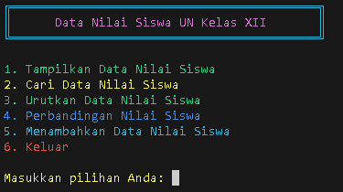

## Daftar Isi

1. [Melihat Data Nilai Siswa](#1-melihat-data-nilai-siswa)
2. [Mencari Data Nilai Siswa](#2-mencari-data-nilai-siswa)
3. [Mengurutkan Data Nilai Siswa](#3-mengurutkan-data-nilai-siswa)
4. [Membandingkan Nilai Siswa](#4-membandingkan-nilai-siswa)
5. [Menambahkan Data Nilai Siswa](#5-menambahkan-data-nilai-siswa)
6. [Keluar](#6-keluar)

## 1. Melihat Data Nilai Siswa

Fitur ini memungkinkan pengguna untuk melihat daftar nilai siswa yang telah diinput ke dalam sistem. Ketika memilih fitur ini, pengguna akan disajikan dengan tampilan yang menunjukkan semua data nilai siswa yang tersedia. Pada tampilan ini, pengguna juga diberikan opsi untuk melakukan edit atau hapus data berdasarkan nama atau NIS (Nomor Induk Siswa) siswa.

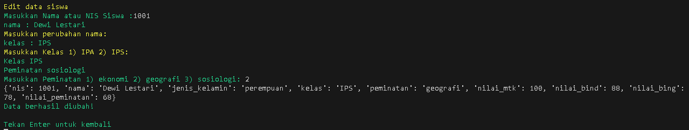

|          Sebelum Dihapus          |         Setelah Dihapus         |
| :-------------------------------: | :-----------------------------: |
| 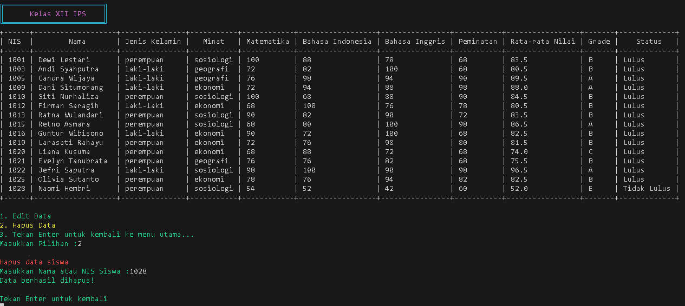 | 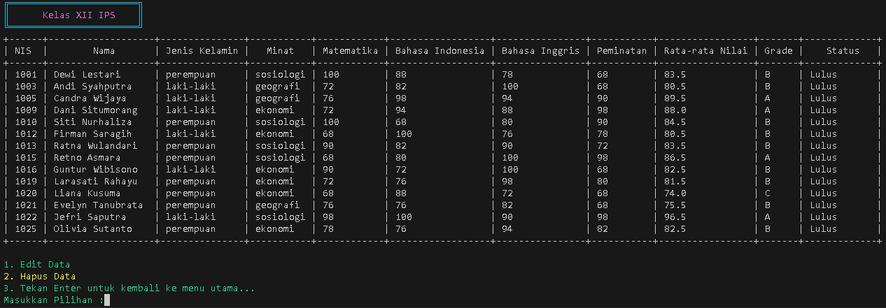 |

## 2. Mencari Data Nilai Siswa

Fitur ini memungkinkan pengguna untuk mencari data nilai siswa berdasarkan kriteria tertentu, seperti nama, NIS, jenis kelamin, kelas, atau peminatan. Pengguna dapat memasukkan kriteria pencarian yang diinginkan, dan sistem akan menampilkan data nilai siswa yang sesuai dengan kriteria tersebut.

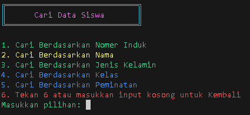

### berdasarkan

|          Nomer Induk          |          Nama           |               Jenis Kelamin               |           Kelas           |             Peminatan             |
| :---------------------------: | :---------------------: | :---------------------------------------: | :-----------------------: | :-------------------------------: |
| 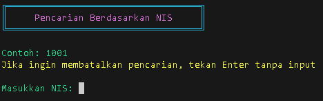 | 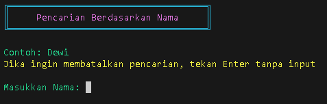 | 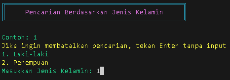 | 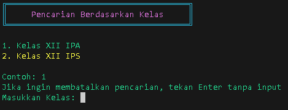 | 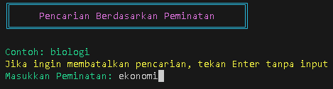 |

## 3. Mengurutkan Data Nilai Siswa

Fitur ini memungkinkan pengguna untuk mengurutkan data nilai siswa berdasarkan kriteria tertentu, seperti nama siswa atau rata-rata nilai siswa. Pengguna dapat memilih kriteria pengurutan yang diinginkan, dan sistem akan menampilkan data nilai siswa yang telah diurutkan berdasarkan kriteria tersebut.

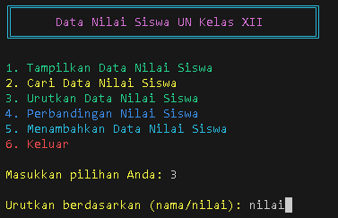

### berdasarkan :

|             Nama             |           Rata-rata Nilai           |
| :--------------------------: | :---------------------------------: |
| 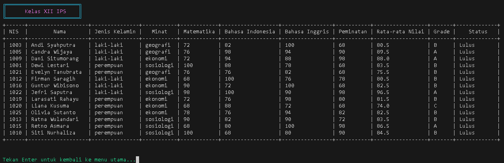 | 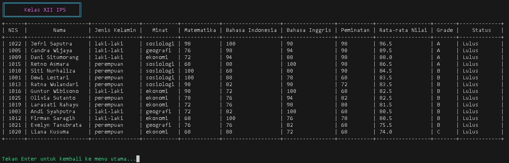 |

## 4. Membandingkan Nilai Siswa

Fitur ini memungkinkan pengguna untuk membandingkan nilai siswa secara lebih rinci. Pengguna dapat melihat perbandingan nilai berdasarkan beberapa kategori seperti jenis kelamin, kelas, dan peminatan.

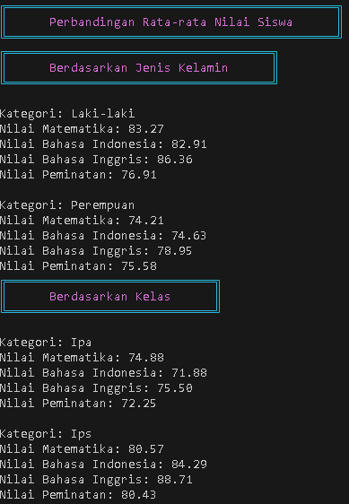

## 5. Menambahkan Data Nilai Siswa

Fitur ini memungkinkan pengguna untuk menambahkan data nilai siswa baru ke dalam sistem. Pengguna akan diminta untuk memasukkan informasi seperti nama, NIS, jenis kelamin, kelas, peminatan, dan nilai-nilai untuk setiap mata pelajaran.

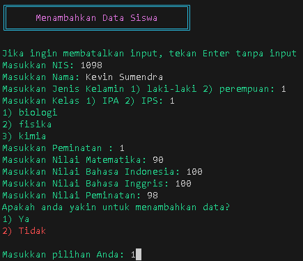

## 6. Keluar

Fitur ini memungkinkan pengguna untuk keluar dari aplikasi setelah selesai menggunakan program.

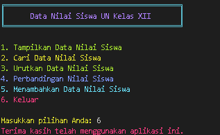
